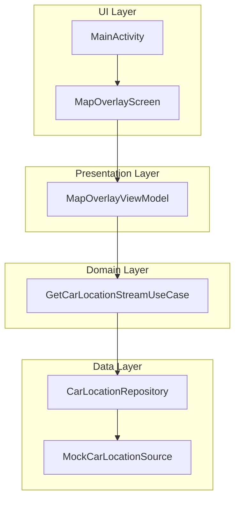

# 차량 위치 오버레이 & 속도 HUD 구현

> 제한 시간 : 60 분
>
>
> 플랫폼 : **Android / Kotlin / Jetpack Compose**
>
> 맵 SDK : **Google Maps Compose v4.1.1** (이미 gradle 의존성 포함)
>

---

## 0. 시나리오

차량 내비게이션 앱의 프로토타입에 **실시간 차량 이동 경로**와 **속도 HUD(Head-Up Display)** 를 추가해야 합니다.

제공된 Starter 코드를 확장하여 ① 차량 마커, ② 주행 Polyline, ③ 현재 속도를 표시하는 HUD 오버레이를 구현합니다.

---

## 구현 내용

### 주요 기능
- Google Maps를 사용한 지도 표시 및 초기화
- 차량의 현재 위치를 마커로 표시
- 차량 이동 경로를 Polyline으로 표시
- 현재 속도를 HUD로 화면 상단에 표시
- 속도에 따라 Polyline 및 HUD 색상 변경 (보너스 과제 B-1)

### 아키텍처 
클린 아키텍처와 MVVM 패턴을 적용하여 구현했습니다.



### 주요 컴포넌트 설명

#### 데이터 계층 (Data Layer)
- **CarLocation**: 차량 위치 및 속도 정보를 담는 데이터 클래스
- **MockCarLocationSource**: 1초마다 차량 위치 정보를 제공하는 Flow 생성
- **CarLocationRepositoryImpl**: 리포지토리 구현체

#### 도메인 계층 (Domain Layer)
- **CarLocationRepository**: 차량 위치 데이터에 접근하기 위한 인터페이스
- **GetCarLocationStreamUseCase**: 차량 위치 정보 Flow를 제공하는 유스케이스

#### 표현 계층 (Presentation Layer)
- **MapOverlayViewModel**: 차량 위치 데이터를 수집하고 UI 상태 관리
- **MapOverlayUiState**: 불변 상태 객체로 UI 상태 관리

#### UI 계층
- **MapOverlayScreen**: 지도와 차량 위치, 경로, HUD를 표시하는 화면
- **SpeedHudOverlay**: 현재 속도를 표시하는 HUD 컴포넌트

## 성능 최적화
- StateFlow와 불변 상태 객체를 활용한 효율적인 상태 관리
- 차량 위치 Flow에 collectLatest 사용으로 백프레셔 처리
- Key를 사용한 LaunchedEffect로 불필요한 재구성 방지

## 접근성
- 속도 HUD에 TalkBack을 위한 콘텐츠 설명 추가 ("현재 속도 시속 n킬로미터")

## 테스트
- CarLocation 데이터 클래스 테스트
- CarLocationRepository 테스트
- MapOverlayViewModel 테스트

---

## 1. 제공 파일

```
/app
 ├─ MainActivity.kt                 // 빈 Compose 화면
 ├─ data/CarLocation.kt             // data class (lat, lng, speedKph)
 ├─ data/MockCarLocationSource.kt   // Flow<CarLocation> @1 Hz
 ├─ ui/theme/*                      // Material3 테마
 └─ build.gradle.kts                // 의존성 완료

```

> Tip : MockCarLocationSource 는 이동 경로가 반복되는 더미 데이터이므로 네트워크 연결 없이 실행됩니다.
>

---

## 2. 필수 구현 사항

| 번호 | 기능 | 수락 기준 |
| --- | --- | --- |
| **F-1** | **지도 초기화** | `rememberMapViewWithLifecycle()` 또는 `GoogleMap()` 컴포저블을 사용해 지도를 렌더링한다. 앱 실행 후 **3 초 이내에 첫 화면**이 보일 것. |
| **F-2** | **차량 마커 표시** | `MockCarLocationSource.flow` 가 발행한 최신 위치로 **Marker**를 위치시킨다. 첫 marker는 **스트림이 시작된 지 3 초 이내**에 나타나야 한다. |
| **F-3** | **경로 Polyline 그리기** | 스트림이 emit 할 때마다 **이전 위치들과 연결**해 Polyline을 갱신한다. **FPS ≥ 55** (Logcat `Choreographer` Frame Time) |
| **F-4** | **속도 HUD** | `CarLocation.speedKph` 값을 `Text` 컴포저블로 상단 중앙에 Overlay 한다. 값은 **최대 1 초 지연**으로 갱신되어야 한다. |
| **F-5** | **상태 관리** | Marker·Polyline·HUD 상태를 `ViewModel + StateFlow` 혹은 `MutableState` 로 분리해 Compose Recomposition을 최소화한다. |

---

## 3. 기술·아키텍처 제약

| 항목 | 조건 |
| --- | --- |
| 언어 | **Kotlin 2.1** 이상 (K2 컴파일러 허용) |
| UI Toolkit | **Jetpack Compose Material 3** 필수 |
| 아키텍처 | **MVVM + Clean Architecture** 권장 (단일 모듈이어도 구조를 구분) |
| 코루틴 | `collectLatest` · `withTimeoutOrNull` 등으로 **Back-pressure** 대응 |
| 성능 | 최초 설치 시 **apk ≤ 40 MB**, 테스트 중 **메모리 피크 ≤ 120 MB** |
| 접근성 | HUD `Text` 에 **TalkBack label**("현재 속도 시속 n킬로미터") 추가 |

---

## 4. 평가 기준 (총 100 점)

| 영역 | 세부 기준 | 배점 |
| --- | --- | --- |
| 기능 완성도 | F-1 ~ F-5 충족 여부 | 40 |
| 코드 품질 | SOLID 적용, 네이밍, 주석, 모듈화 | 20 |
| 성능 최적화 | FPS 로그, 메모리 사용, 첫 Marker 지연 | 15 |
| 아키텍처 설계 | ViewModel·Repository·UI 분리, 테스트 용이성 | 15 |
| 테스트 | 단위 테스트(Flow 테스트 포함) ≥ 3개 | 5 |
| README | 실행 방법, 스크린샷 또는 GIF, 측정 로그 | 5 |

---

## 5. 제출 규칙

1. **브랜치명** : `livecoding/feature/hud-overlay`
2. **커밋 메시지** : Conventional Commits (`feat:`, `fix:` …)
3. **Push** 후 GitHub Actions CI (**Gradle build + `ktlint`**) 통과
4. **README.md** 에
  - 구현 흐름 다이어그램(PlantUML or Mermaid)
  - 성능 측정 스크린샷(Logcat 또는 Profiler)
  - 실행 GIF(15 초 이내) 포함

---

## 6. 보너스 과제 (선택)

| 번호 | 내용 | 가산점 |
| --- | --- | --- |
| B-1 | **속도에 따라 Marker 색상** 변경 (예: 0~~30 KPH 녹색, 30~~60 노랑, 60↑ 빨강) | +3 |
| B-2 | **Polyline Gradient** (속도 기반 색 보간) | +2 |
| B-3 | **지도 회전** : 카메라 Bearing을 차량 Heading 값과 동기화 | +3 |
| B-4 | **권한 처리** : 실제 기기로 전환 시 `ACCESS_FINE_LOCATION` 요청 흐름 구현 | +2 |

---

## 7. 로컬 빌드 & 실행

```bash
# JDK 17 이상
./gradlew clean installDebug
adb install -r app/build/outputs/apk/debug/app-debug.apk

```

> 테스트 계측 : ./gradlew :app:connectedDebugAndroidTest
>
>
> **FPS 확인** : Logcat 검색어 `Choreographer` → `Skipped frames` 가 0 인지 점검
>

---

**행운을 빕니다!**

제출 전 `README`의 체크리스트를 모두 완료했는지 확인하세요.